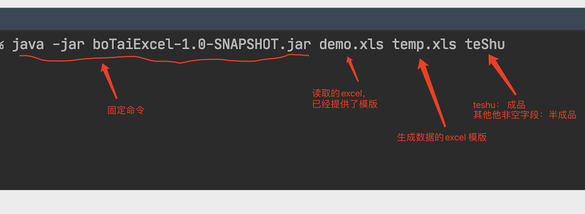

# boTaiExcel
 博泰基础excel信息整理

 该项目打包后为： ExcelDoing-1.0-SNAPSHOT.jar

`java -jar boTaiExcel-1.0-SNAPSHOT.jar 产品下料工艺-总表.xls temp.xls`

执行前确认并删除 `ExcelDoing-1.0-SNAPSHOT.jar` 同级目录下的 `excels` 文件夹及其子文件（后期会增加自动shell命令删除该文件夹）
然后运行上面命令 

